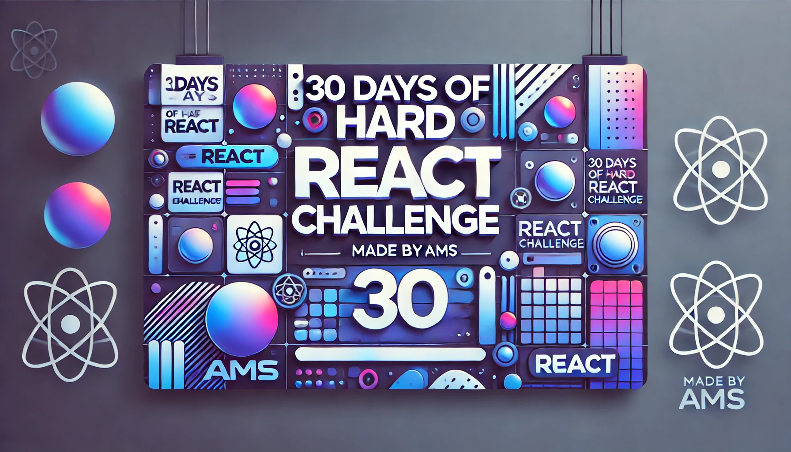

<div align="center">
  <h1> 30 Days Of React: Getting Started React</h1>
  <a class="header-badge" target="_blank" href="https://www.linkedin.com/in/amsmishra/">
  
  </a>
  <a class="header-badge" target="_blank" href="https://x.com/ezYams">
  
  </a>

<sub>Author:
<a href="https://www.linkedin.com/in/amsmishra/" target="_blank">Amit Mishra</a><br>
<small> December 24, 2024</small>
</sub>

</div>

[<< Day 1](../01_Day_Introduction_To_React/README.md) | [Day 3 >>](../03_Day_Setting_Up/README.md)



# Table of Contents

1. [What are React Components?](#1-what-are-react-components)
2. [Types of Components](#2-types-of-components)
   - [Functional Components](#a-functional-components)
   - [Class Components](#b-class-components)
3. [Parent and Child Components](#3-parent-and-child-components)
4. [JSX (JavaScript XML)](#4-jsx-javascript-xml)
5. [Combining Components](#5-combining-components)
6. [Reusability (Using Components Multiple Times)](#6-reusability-using-components-multiple-times)
7. [Pure Components](#7-pure-components)
8. [Functional vs Class Components](#8-functional-vs-class-components)
9. [Tasks for Practice](#9-tasks-for-practice)
   - [Exercises: Level 1](#exercises-level-1)
   - [Exercises: Level 2](#exercises-level-2)
   - [Exercises: Level 3](#exercises-level-3)

# React Components: Detailed Overview

## **1. What are React Components?**

- React Components are the **building blocks** of a React application.
- They help in creating **reusable UI parts**.
- Components can be written as **functions** or **classes**.

---

## **2. Types of Components**

### **(A) Functional Components**

- These are simple JavaScript functions that return JSX (HTML-like code).

#### Syntax:

```jsx
function ComponentName() {
  return <div>This is a Functional Component!</div>;
}
```

#### Example:

```jsx
import React from "react";

function Welcome() {
  return <h1>Welcome to React Functional Components!</h1>;
}

export default Welcome;
```

### **(B) Class Components**

- These use ES6 classes and must include a `render()` method to return JSX.

#### Syntax:

```jsx
class ComponentName extends React.Component {
  render() {
    return <div>This is a Class Component!</div>;
  }
}
```

#### Example:

```jsx
import React, { Component } from "react";

class Welcome extends Component {
  render() {
    return <h1>Welcome to React Class Components!</h1>;
  }
}

export default Welcome;
```

---

## **3. Parent and Child Components**

- A **Parent Component** can include other components called **Child Components**.

### Parent Component:

```jsx
import React from "react";
import Child from "./Child";

function Parent() {
  return (
    <div>
      <h1>I am the Parent Component</h1>
      <Child /> {/* Including Child Component */}
    </div>
  );
}

export default Parent;
```

### Child Component:

```jsx
import React from "react";

function Child() {
  return <h2>I am the Child Component</h2>;
}

export default Child;
```

---

## **4. JSX (JavaScript XML)**

- JSX allows you to write HTML-like code inside JavaScript.

### Example:

```jsx
function App() {
  return (
    <div>
      <h1>Hello JSX!</h1>
      <p>This is a mix of HTML and JavaScript.</p>
    </div>
  );
}

export default App;
```

---

## **5. Combining Components**

- Multiple components can be combined to create a larger application.

### Example:

```jsx
import React from "react";
import Header from "./Header";
import Footer from "./Footer";

function App() {
  return (
    <div>
      <Header />
      <h1>Welcome to My App</h1>
      <Footer />
    </div>
  );
}

export default App;
```

#### Header.js

```jsx
function Header() {
  return <header>This is the Header</header>;
}

export default Header;
```

#### Footer.js

```jsx
function Footer() {
  return <footer>This is the Footer</footer>;
}

export default Footer;
```

---

## **6. Reusability (Using Components Multiple Times)**

- React components can be reused with dynamic data.

### Example:

```jsx
function Button({ label }) {
  return <button>{label}</button>;
}

function App() {
  return (
    <div>
      <Button label="Submit" />
      <Button label="Cancel" />
    </div>
  );
}

export default App;
```

---

## **7. Pure Components**

- These components optimize performance by avoiding unnecessary re-renders.

### Example:

```jsx
import React, { PureComponent } from "react";

class MyComponent extends PureComponent {
  render() {
    console.log("Rendered!");
    return <h1>Hello, Pure Component!</h1>;
  }
}

export default MyComponent;
```

---

## **8. Functional vs Class Components**

| Feature           | Functional Components     | Class Components |
| ----------------- | ------------------------- | ---------------- |
| Syntax            | Simple function           | ES6 class        |
| State Management  | `useState` hook           | `this.state`     |
| Lifecycle Methods | Hooks (e.g., `useEffect`) | Direct methods   |
| Performance       | Faster                    | Slower           |
| Usage             | Modern React              | Legacy React     |

---

## **9. Tasks for Practice**

## Exercises: Level 1

1. What is the difference between a regular function and an arrow function?
2. What is a React Component?
3. How do you make a React functional component?
4. What is the difference between a pure JavaScript function and a functional component?
5. How small should a React component be?
6. Can we make a button or input field a component?
7. **Task**: Make a reusable Button component.
8. **Task**: Make a reusable InputField component.
9. **Task**: Create a reusable alert box component with:
   - A single `div` parent element.
   - A `p` child element inside the `div` for displaying messages (e.g., warning alert box, success alert box).

---

## Exercises: Level 2

1. **Task**: Create functional components and display the following images:
   - Use any images or placeholder content representing frontend-related visuals.
2. **Task**: Use functional components to create a design for a **Newsletter Signup Form**.
   - Include fields like Email, a Subscribe button, and a title.

---

## Exercises: Level 3

1. **Task**: Use the given hexadecimal color generator example to create random colors dynamically.
   - Generate a list of colorful `div` boxes.
2. **Task**: Use functional components to design a **User Card**.
   - Include a profile picture, username, and a short description.
   - Make it visually appealing and styled using CSS.

---

## 🎉 CONGRATULATIONS! 🎉

You've completed the exercises for React Components! 🚀
